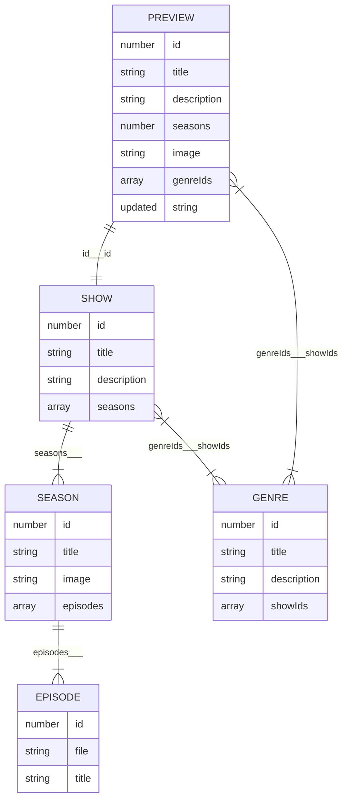

# PODCAST APP 💿
[DJS11] Instructions for the Final Portfolio Piece Submission

<!-- omit in toc -->
**Table of Contents**

- [🤖 Technology](#-technology)
- [📦Data](#data)
	- [Relationships](#relationships)
	- [Endpoints](#endpoints)
	- [Genre Titles](#genre-titles)
- [🧑 User Stories](#user-stories)

## 🤖 Technology

**You will be required to complete this project with in React, it is strongly advised that you use React and/or build-process to manage all complexity involved.** 

You are welcome to use any other technology set that you are comfortable with as well as React. It is recommended that you use TypeScript as well, however you are welcome to avoid TypeScript entirely if you do not feel comfortable with it’s usage just yet.

## 📦Data

**Data consists of three basic semantic units**

- `SHOW`: A specific podcast that contains a single or several `SEASON`
- `SEASON`: A collection of `EPISODE` released across a specific timespan
- `EPISODE`: Corresponds to a specific MP3 file that user can listen

However, the following information is also exposed via the API

- `PREVIEW`: A summarised version of a `SHOW` that only contains basic information. Usually exposed when an array of different `SHOW` information is requested.
- `GENRE`: Information related to a (one of many) genres that can be assigned to a `SHOW`

### Relationships

The following chart indicates the relations between units of data. It uses Entity Relationship mapping. In order to understand the meaning of symbols in the chart please read [the overview on the Mermaid.js documentation](https://mermaid.js.org/syntax/entityRelationshipDiagram.html). 

Note that the text between the units indicates what properties map to one another. It is separated by means of three underscores (`___`). The value before the underscores is the mapping from the parent object, whereas the values after the underscore is the mapping from the child object.

_Note that is some cases there is no way to infer the parent from the child itself , in those cases just the parent map is noted, with no value after the underscores_.

### Endpoints

Data can be called via a `fetch` request to the following three endpoints. Note that there is not always a one-to-one mapping between endpoints and actual data structures. Also note that  ***`<ID>`** indicates where the dynamic ID for the requested item should be placed. For example: `[https://podcast-api.netlify.app/genre/3](https://podcast-api.netlify.app/genre/3)`* 

| URL |  |
| --- | --- |
| `https://podcast-api.netlify.app` | Returns an array of PREVIEW |
| `https://podcast-api.netlify.app/genre/<ID>` | Returns a GENRE object |
| `https://podcast-api.netlify.app/id/<ID>` | Returns a SHOW object with several SEASON and EPISODE objects directly embedded within |

### Genre Titles

Since genre information is only exposed on `PREVIEW` by means of the specific `GENRE` id, it is recommended that you include the mapping between genre id values and title in your code itself:

| ID | Title |
| --- | --- |
| 1 | Personal Growth |
| 2 | Investigative Journalism |
| 3 | History |
| 4 | Comedy |
| 5 | Entertainment |
| 6 | Business |
| 7 | Fiction |
| 8 | News |
| 9 | Kids and Family |

## 🧑 User Stories

**There are a total of 50 possible stories below that determine your final grade.**

Each completed story that is verified by code coach will result in you receiving towards x% your final mark. Completing all 50 will result in a mark of 100%. Note that user stories can be completed in any order. If you are stuck on a specific one perhaps try completing another one instead.

---

- ✅Project is deployed to a custom Netlify URL

- ✅ All views in the app display correct on the smallest mobile devices available “Iphone SE”. This can be emulated in Chrome Dev tools.

- ✅ All favicon information has been created an added correctly via [https://realfavicongenerator.net/](https://realfavicongenerator.net/) (you are welcome to use any free PNG image you find on [https://www.flaticon.com/](https://www.flaticon.com/))

- ✅ All metatag information has been creataed and added via [https://metatags.io/](https://metatags.io/) (You are welcome to use any free image you find on [https://unsplash.com/](https://unsplash.com/)). Be mindful to manually replace all URL values (especially image URL) to absolute Netlify URL values (you will need to deploy to Netlify first)

---

