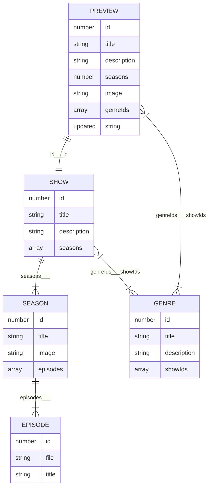

# 🎵 PODCAST APP | PORTFOLIO PIECE 💿
[DJS11] Starter Instructions for the Final Portfolio Piece Submission 🚀

<!-- omit in toc -->
**Table of Contents**

- [🤖 Technology](#-technology)
- [📦Data](#data)
	- [Relationships](#relationships)
	- [Endpoints](#endpoints)
	- [Genre Titles](#genre-titles)
- [🧑 User Stories](#user-stories)

## 🤖 Technology

**You will be required to complete this project with in React, it is strongly advised that you use React and/or build-process to manage all complexity involved.** 

You are welcome to use any other technology set that you are comfortable with as well as React. It is recommended that you use TypeScript as well, however you are welcome to avoid TypeScript entirely if you do not feel comfortable with it’s usage just yet.

## 📦Data

**Data consists of three basic semantic units**

- `SHOW`: A specific podcast that contains a single or several `SEASON`
- `SEASON`: A collection of `EPISODE` released across a specific timespan
- `EPISODE`: Corresponds to a specific MP3 file that user can listen

However, the following information is also exposed via the API

- `PREVIEW`: A summarised version of a `SHOW` that only contains basic information. Usually exposed when an array of different `SHOW` information is requested.
- `GENRE`: Information related to a (one of many) genres that can be assigned to a `SHOW`

### Relationships

The following chart indicates the relations between units of data. It uses Entity Relationship mapping. In order to understand the meaning of symbols in the chart please read [the overview on the Mermaid.js documentation](https://mermaid.js.org/syntax/entityRelationshipDiagram.html). 

Note that the text between the units indicates what properties map to one another. It is separated by means of three underscores (`___`). The value before the underscores is the mapping from the parent object, whereas the values after the underscore is the mapping from the child object.

_Note that is some cases there is no way to infer the parent from the child itself , in those cases just the parent map is noted, with no value after the underscores_.

### Endpoints

Data can be called via a `fetch` request to the following three endpoints. Note that there is not always a one-to-one mapping between endpoints and actual data structures. Also note that  ***`<ID>`** indicates where the dynamic ID for the requested item should be placed. For example: `[https://podcast-api.netlify.app/genre/3](https://podcast-api.netlify.app/genre/3)`* 

| URL |  |
| --- | --- |
| `https://podcast-api.netlify.app` | Returns an array of PREVIEW |
| `https://podcast-api.netlify.app/genre/<ID>` | Returns a GENRE object |
| `https://podcast-api.netlify.app/id/<ID>` | Returns a SHOW object with several SEASON and EPISODE objects directly embedded within |

### Genre Titles

Since genre information is only exposed on `PREVIEW` by means of the specific `GENRE` id, it is recommended that you include the mapping between genre id values and title in your code itself:

| ID | Title |
| --- | --- |
| 1 | Personal Growth |
| 2 | Investigative Journalism |
| 3 | History |
| 4 | Comedy |
| 5 | Entertainment |
| 6 | Business |
| 7 | Fiction |
| 8 | News |
| 9 | Kids and Family |

## 🧑 User Stories

**There are a total of 50 possible stories below that determine your final grade.**

Each completed story that is verified by code coach will result in you receiving towards x% your final mark. Completing all 50 will result in a mark of 100%. Note that user stories can be completed in any order. If you are stuck on a specific one perhaps try completing another one instead.

---

- ✅Project is deployed to a custom Netlify URL

- ✅ All views in the app display correct on the smallest mobile devices available “Iphone SE”. This can be emulated in Chrome Dev tools.

- ✅ All favicon information has been created an added correctly via [https://realfavicongenerator.net/](https://realfavicongenerator.net/) (you are welcome to use any free PNG image you find on [https://www.flaticon.com/](https://www.flaticon.com/))

- ✅ All metatag information has been creataed and added via [https://metatags.io/](https://metatags.io/) (You are welcome to use any free image you find on [https://unsplash.com/](https://unsplash.com/)). Be mindful to manually replace all URL values (especially image URL) to absolute Netlify URL values (you will need to deploy to Netlify first)

---

| CODE | CATEGORY                          | USER STORIES                                                                                          | DIFFICULTY | TOTAL |
|------|-----------------------------------|------------------------------------------------------------------------------------------------------|------------|-------|
| P3.1 | Setup and Deployment              | ✅ Project is deployed to a custom Netlify URL                                                          | Medium     | 2     |
| P3.2 |                                   | ✅ All views in the app display correctly on the smallest mobile devices available "iPhone SE".         | Hard       | 3     |
| P3.3 |                                   | ✅ All favicon information has been created and and added via [https://metatags.io/](https://metatags.io/) (You are welcome to use any free image you find on [https://unsplash.com/](https://unsplash.com/)). Be mindful to manually replace all URL values (especially image URL) to absolute Netlify URL values (you will need to deploy to Netlify first)                                        | Easy       | 1     |
| P3.4 |                                   | ✅ All favicon information has been created an added correctly via [https://realfavicongenerator.net/](https://realfavicongenerator.net/) (you are welcome to use any free PNG image you find on [https://www.flaticon.com/](https://www.flaticon.com/))                                                  | Easy       | 1     |
| P3.5 | UI/UX                             | ✅ User sees the name of all available shows on the platform                                            | Easy       | 1     |
| P3.6 |                                   | ✅ User sees shows broken down into seasons, sorted by number                                           | Hard       | 3     |
| P3.7 |                                   | ✅ User has a way to listen to any episode in a season for a show                                       | Medium     | 2     |
| P3.8 |                                   | ✅ User is able to see a view where only episodes for a specific selected season are shown              | Medium     | 2     |
| P3.9 |                                   | ✅ User is able to toggle between different seasons for the same show                                   | Hard       | 3     |
| P3.10|                                   | ✅ User sees preview image of shows when browsing                                                       | Easy       | 1     |
| P3.11|                                   | ✅ User sees the amount of seasons as a number in a show when browsing                                  | Easy       | 1     |
| P3.12|                                   | ✅ User sees a human-readable date to when a show was last updated                                      | Easy       | 1     |
| P3.13|                                   | ✅ User sees what genres (as genre titles) a show is associated with when browsing                      | Medium     | 2     |
| P3.14|                                   | ✅ User sees a preview image of seasons for a specific show                                             | Easy       | 1     |
| P3.15|                                   | ✅ User sees the amount of episodes as a number for a season                                            | Easy       | 1     |
| P3.16|                                   | ✅ User is able to go back to a show view from a season-specific view                                   | Easy       | 1     |
| P3.17| Data Fetching and State Management| ✅ All show data loaded via a fetch call from the API                                                   | Medium     | 2     |
| P3.18|                                   | ✅ All data is loaded via a fetch and no endpoint-specific data is hardcoded                            | Medium     | 2     |
| P3.19|                                   | ✅ When viewing a specific show, data is loaded via fetch from individual show endpoint                 | Medium     | 2     |
| P3.20|                                   | ✅ There is a loading state while initial data is being loaded                                          | Medium     | 2     |
| P3.21|                                   | ✅ There is a loading state while new data is being loaded                                              | Hard       | 3     |
| P3.22| User Interaction                  | ✅ User is able to mark specific episodes as favourites so that they can find them again                | Hard       | 3     |
| P3.23|                                   | ✅ User can visit a view where they see all their favourites                                            | Medium     | 2     |
| P3.24|                                   | ✅ User is able to see the associated show and season when an episode is in favourites                  | Medium     | 2     |
| P3.25|                                   | ✅ Related by season/show episodes are grouped together in favourites                                  | Medium     | 2     |
| P3.26|                                   | ✅ User is able to remove episodes from their favourites                                                | Medium     | 2     |
| P3.27|                                   | ✅ User is able to arrange lists of shows based on title from A-Z                                       | Medium     | 2     |
| P3.28|                                   | ✅ User is able to arrange lists of shows based on title from Z-A                                       | Medium     | 2     |
| P3.29|                                   | ✅ User is able to arrange list showing the most recently updated                                       | Medium     | 2     |
| P3.30|                                   | ✅ User is able to arrange list of shows from least recently updated                                    | Medium     | 2     |
| P3.31|                                   | ✅ User sees the date and time that they added something as a favourite                                 | Medium     | 2     |
| P3.32|                                   | ✅ User is able to arrange favourites based on title from A-Z                                           | Medium     | 2     |
| P3.33|                                   | ✅ User is able to arrange favourites based on title from Z-A                                           | Medium     | 2     |
| P3.34|                                   | ✅ User is able to arrange favourites starting with the most recently updated                           | Medium     | 2     |
| P3.35|                                   | ✅ User is able to arrange favourites starting with the furthest back updated                           | Medium     | 2     |
| P3.36|                                   | ✅ Audio player is always visible so that user can listen to episodes while browsing                    | Medium     | 2     |
| P3.37|                                   | ✅ User receives a notification that confirms they want to close the page when audio is playing         | Medium     | 2     |
| P3.38|                                   | ✅ Automatically filters shows by a genre if the genre label is clicked on                              | Hard       | 3     |
| P3.39| Persistence and Storage           | ✅ App remembers and shows what episodes user listened to all the way through                           | Medium     | 2     |
| P3.40|                                   | ✅ User has the option to "reset" all their progress, effectively removing their listening history      | Medium     | 2     |
| P3.41| Overall Assessment                | ✅ The project has a good appearance and layout when opened in a web browser                            | Easy       | 3     |
| P3.42|                                   | ✅ The project is easy to navigate and interact with through a web browser                              | Easy       | 3     |
| P3.43|                                   | ✅ The project's commit history shows short and clear commit messages                                   | Easy       | 3     |
| P3.44|                                   | ✅ The project displays well on different devices and screen sizes                                      | Easy       | 3     |
| P3.45|                                   | ✅ The README file includes a comprehensive introduction to the project, setup instructions, and contact| Easy       | 3     |
| P3.46| Additional Features               | ✅ User is presented with a sliding carousel of possible shows they might be interested in on the landing page | Hard   | 3     |
| P3.47|                                   | ✅ User is able to filter shows based on title by means of a text input                                 | Hard       | 3     |
| P3.48|                                   | ✅ User is able to find shows based on fuzzy matching of concepts                                       | Hard       | 3     |
| P3.49|                                   | ✅ App remembers and shows the exact timestamp location of where they left off any episode              | Hard       | 3     |
| P3.50|                                   | ✅ The project has extra features that make for a good user-experience besides the stretch goals        | Hard       | 3     |  
